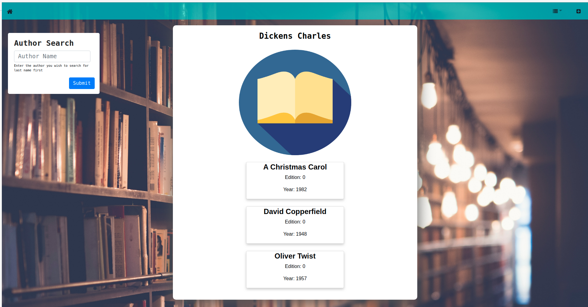
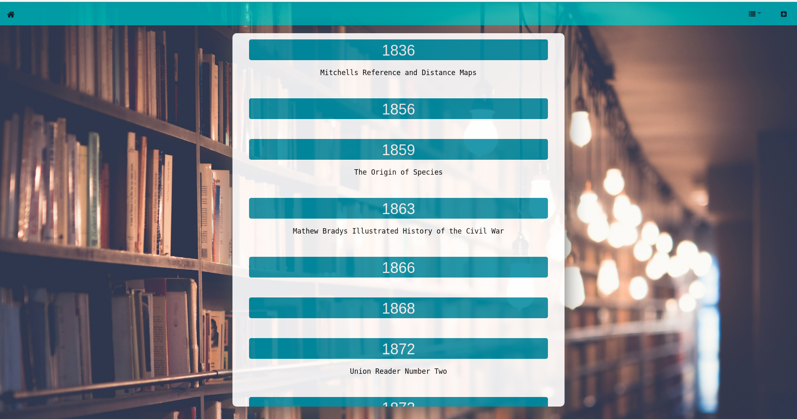
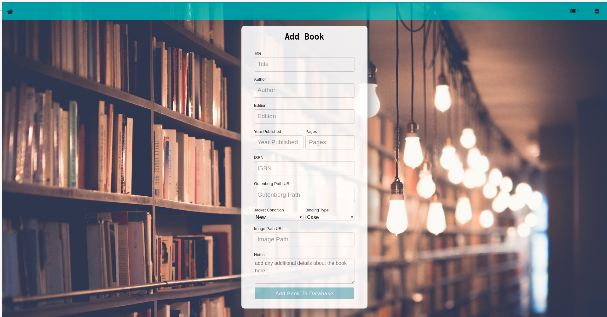

## Project Overview
You have set up a database, now do something with it. 

Suggestions:
- Add a front end for data entry or user querying.
- Create a dashboard to allow someone to monitor the collection.
- Create a program to pull data from another data source (AbeBooks.com, Google Books,Gutenberg.org, etc.) to improve the quality of the data in the database.
- Create a program to pull text copies of books in the database and perform text analytics on them

Prepare a 5 minute video presentation explaining what you have done and demonstrate how it works.  

## How to Run:
### Install node_modules

`yarn install`

*Installs all the required dependencies for running the book_website application.*

## How to Run in Dev

`yarn start`

*Runs the app in the development mode. *

Open [http://localhost:3000](http://localhost:3000) to view it in the browser. 
Note: Runs best in google-chrome.

The page will reload if you make edits. 
You will also see any lint errors in the console.

## Final Product

## Contributors:
- George Ward
- Joseph Klutenkamper
- Luke Malloy
- Courtney Owings
- Skylar Trendley
